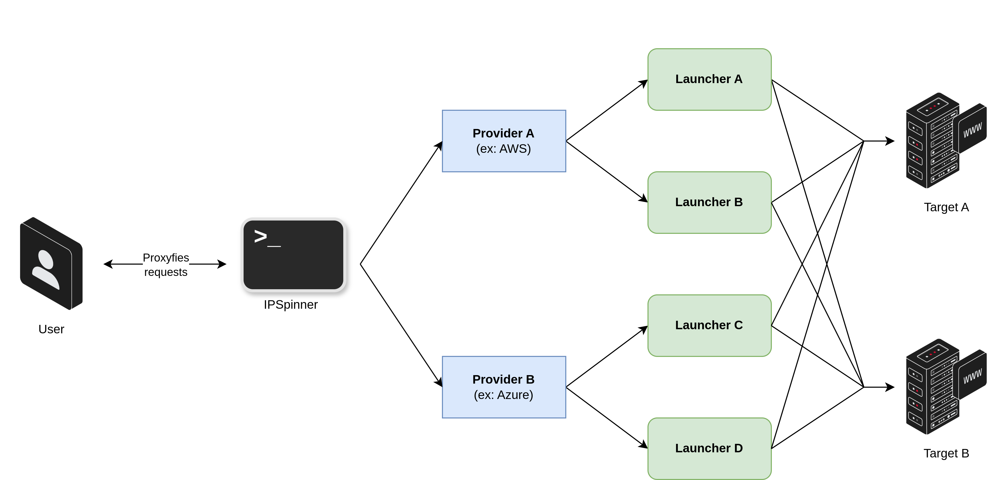
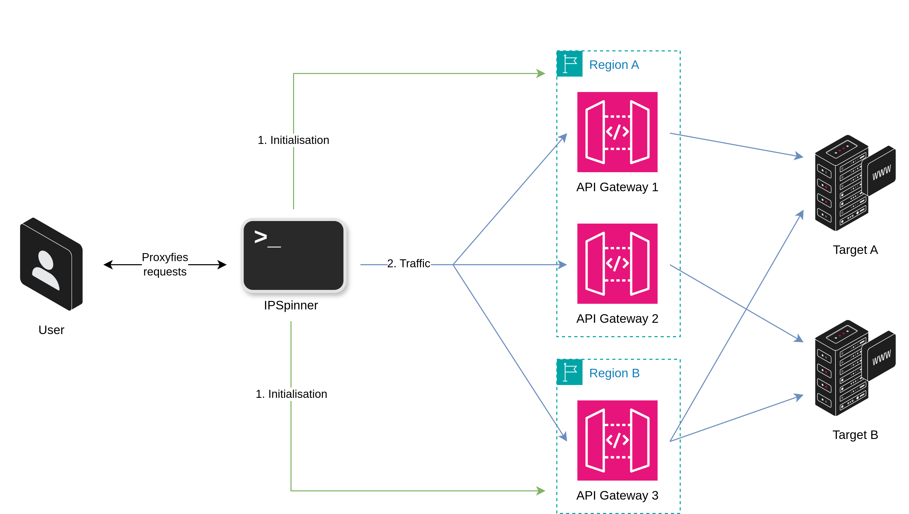
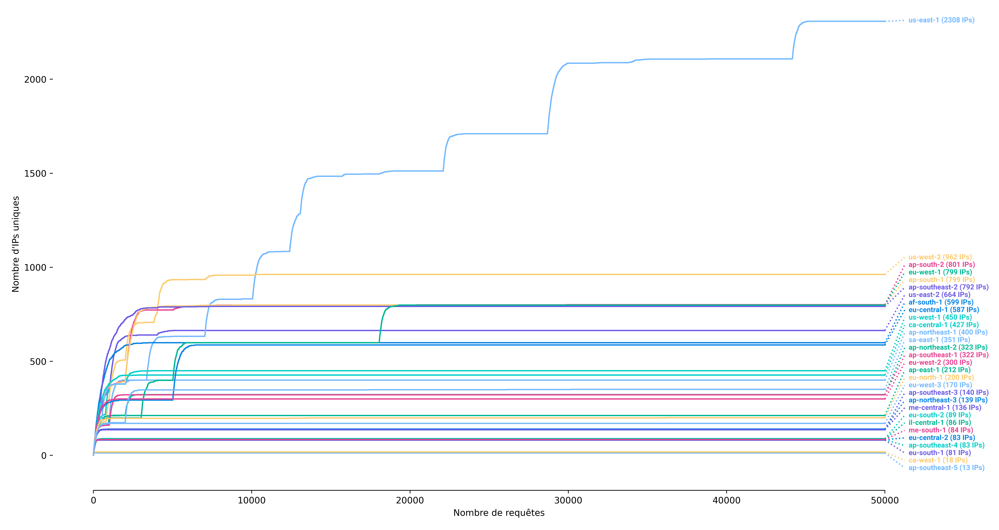
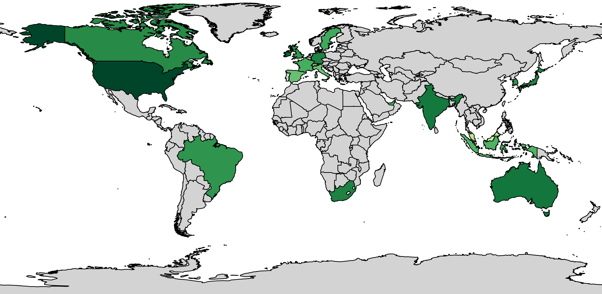
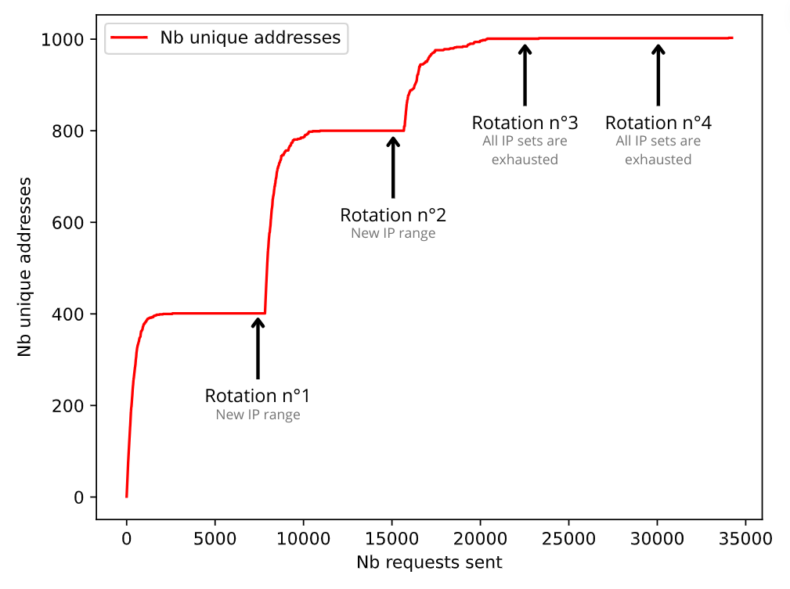
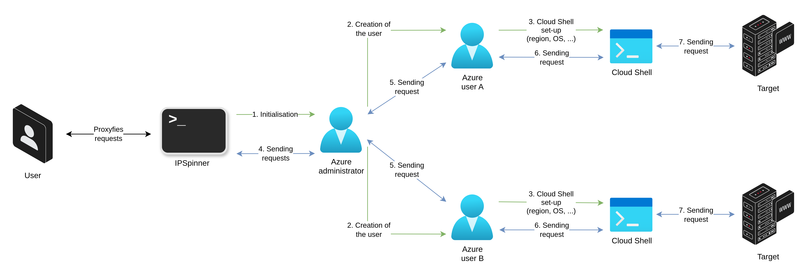
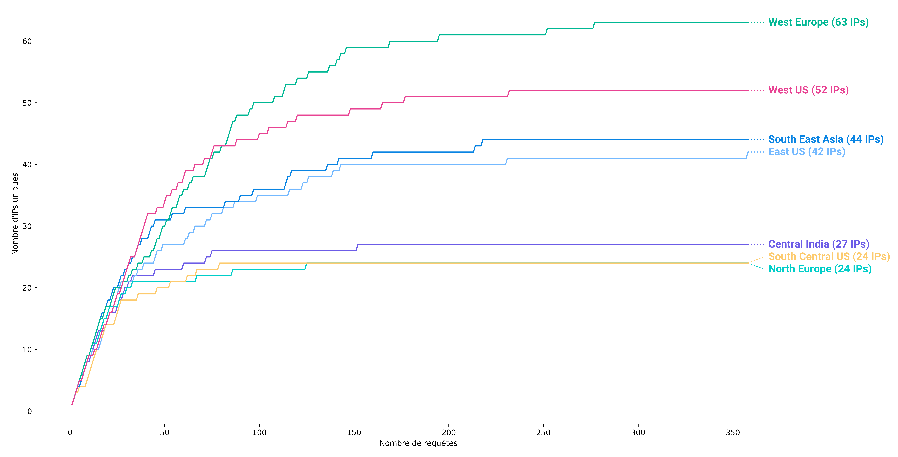
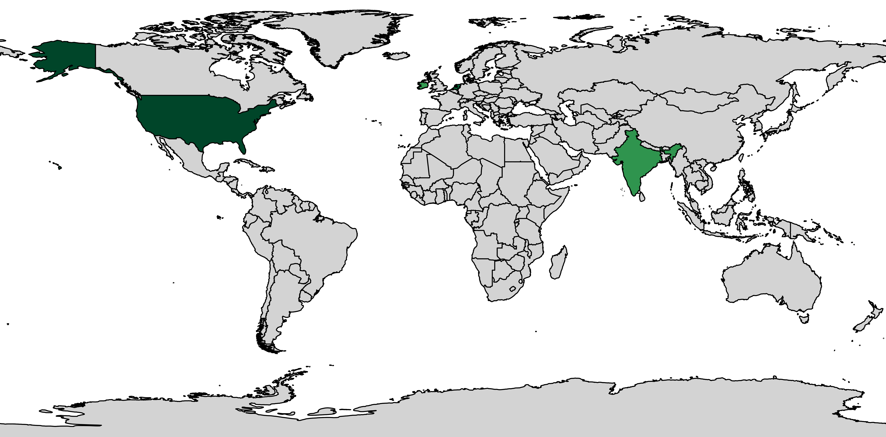
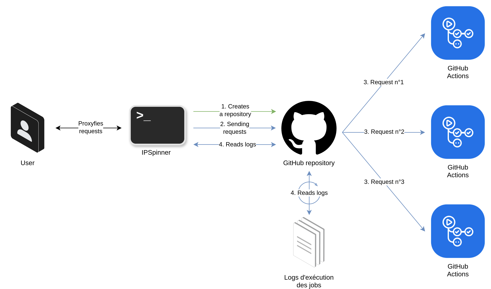
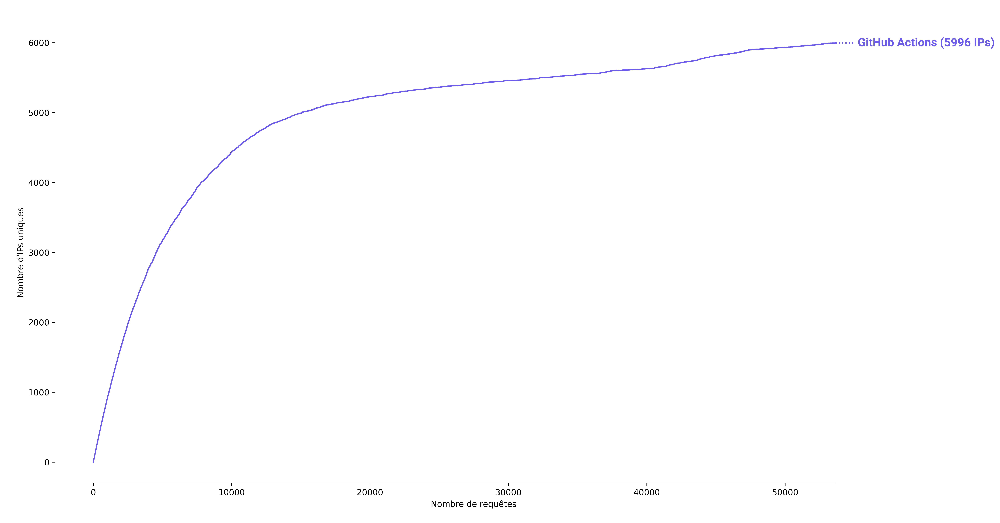

# 🔁 IPSpinner

IPSpinner is a local proxy which can be used to redirect all incoming requests through different chosen providers. The purpose is to create a pass-through proxy that rotates the source IP address of each request. As an example, running a bruteforce operation through IPSpinner will help to avoid being caught because the server will receive the requests from hundreds of different IP addresses.

IPSpinner currently supports AWS (API Gateway), Azure (Cloud Shell) and GitHub (GitHub Actions).

# Table of contents

1. [How it works?](#i-how-it-works)
    1. [General](#1-general)
    2. [Per provider & launcher](#2-per-provider-launcher)
        1. [AWS API Gateway](#i-aws-api-gateway)
        2. [Azure Cloud Shell](#ii-azure-cloud-shell)
        3. [GitHub Actions](#iii-github-actions)
    3. [Launcher comparison](#3-launcher-comparison)
2. [How to install?](##ii-how-to-install)
    1. [Install Go](#1-install-go)
    2. [Clone and build IPSpinner](#2-clone-and-build-ipspinner)
    3. [Clean builds](#3-clean-builds)
3. [How to use?](#iii-how-to-use)
    1. [General](#1-general-1)
        1. [Command line arguments](#i-command-line-arguments)
        2. [Configuration file](#ii-configuration-file)
    2. [Per provider](#2-per-provider)
        1. [AWS](#i-aws)
        2. [Azure](#ii-azure)
        3. [GitHub](#iii-github)
4. [How to ...?](#iv-how-to-)
    1. [HTTP/2 support?](#1-http2-support)

# I/ How it works?

## 1) General

<div align="center">
    
    <span>Figure 1: IPSpinner - Overall diagram</span>
</div>

IPSpinner works as a local proxy that redirects requests through external services. For this purpose, IPSpinner leverages providers and launchers.

A provider corresponds to a cloud provider or an online service provider (AWS, Azure, GitHub, etc.), which offers different services, so called launchers, that can be used to relay user's requests (AWS API Gateway, GitHub Actions, Azure Cloud Shells, etc.).

Thus, in order to launch IPSpinner, the user will have to provide credentials for the providers he wants to use and additional configurations for the launchers. Multiple launcher types can be used at the same time, IPSpinner will choose randomly one of the available ones for each request.

Moreover, IPSpinner implements a preload feature. Some launchers can be preloaded to avoid the reconfiguration delay in the case a new host is seen by the proxy. For these launcher, the preload procedure is recommended but not mandatory. For the others, no preloading is necessary.


## 2) Per provider & launcher

### i. AWS API Gateway

#### Introduction

IPSpinner can leverage AWS API Gateway for sending requests. This implementation is based on [FireProx](https://github.com/ustayready/fireprox), which creates a REST API Gateway to redirect incoming requests. FireProx has therefore been adapted to handle multiple hosts per API Gateway and to implement new features. To sum up, when IPSpinner receives a request, it selects or creates the right API Gateway instance and sends towards the request. Then, it gathers the response and returns it to the user. Thus, the targeted server has received the request from the API Gateway and not directly from the user. As API Gateway rotates its outgoing IP for each request, IPSpinner uses this feature to make IP address rotating. 

<div align="center">
    
    <span>Figure 2: AWS API Gateway - Overall diagram</span>
</div>

The next graph, made in October 2024, shows the number of unique IP addresses available per AWS region according to the number of requests sent. Most of the regions offer more than 100 IP addresses and multiple regions can be used at the same time, allowing the user to proxifies his requests through thousands of worldwide addresses.

<div align="center">
    
    <span>Figure 3: AWS API Gateway - Available IP addresses per region</span>
</div>

Finally, the Figure 4 shows, with a logarithmic green color level, how many addresses are available per country. It demonstrates that the user has the possibility to falsify his source IP address with addresses on any continent.

<div align="center">
    
    <span>Figure 4: AWS API Gateway - IP addresses per country</span>
</div>

#### Noteworthy details

IPSpinner implements a rotation feature that reguarly deletes and renews created FireProx instances. As the following graph shows, rotating a FireProx instance may deliver a new subset of IP. However, each AWS region has a limited set of IP and therefore at some point, rotations will not deliver new IPs.

<div align="center">
    
    <span>Figure 5: AWS API Gateway - Rotating process</span>
</div>

This launcher implements a preloading procedure. As said before, it is not mandatory, but can prevent some reconfiguration delays or synchronisation errors during the first seconds after being reconfigured.

Moreover, API Gateways set by default a X-Forwarded-For header, which cannot be deleted but can be overrided. Thus, the user can specify in the IPSpinner configuration an IP address range from which an random IP will be chosen for each request (IPv4 or IPv6 range).


### ii. Azure Cloud Shell

#### Introduction

IPSpinner leverages Azure Cloud Shell to send requests. An Azure Cloud Shell is an interactive, authenticated, browser-accessible terminal for managing Azure resources. Cloud Shell runs on a temporary host provided on a per-session, per-user basis.

Thus, IPSpinner uses several Azure users for whom a Cloud Shell session is prepared. Then, each request will be redirected to an initialised Cloud Shell, before being renewed to reset its IP address.

<div align="center">
    
    <span>Figure 6: Azure Cloud Shell - Overall diagram</span>
</div>

As the following graph shows, the different regions available to deploy Cloud Shells sessions each offer dozens of IP addresses. The user can configure multiple regions at the same time to increase his IP pool.

<div align="center">
    
    <span>Figure 7: Azure Cloud Shell - Available IP addresses per region</span>
</div>

However, IP addresses are more concentrated than for AWS API Gateway. As the following map illustrates, most of them are located in the US, in Europe and in India.

<div align="center">
    
    <span>Figure 8: Azure Cloud Shell - IP addresses per country</span>
</div>

#### Noteworthy details

Due to the Cloud Shell renewing process delay, we advise to limit the request flow rate. More information in the [launcher comparison](#3-launcher-comparison) subsection.


### iii. GitHub Actions

#### Introduction

IPSpinner can also take advantage of the GitHub Actions to send requests. This implementation is inspired of [git-rotate](https://github.com/dunderhay/git-rotate) but has been completely modified and adapted to get rid of the catcher server.

It creates a repository with a predefined workflow template. Then, for each request, it runs the workflow by giving request information through the environment variables. All data is encrypted to avoid being readable by an external user. IPSpinner finally collects response data from the workflow logs.

<div align="center">
    
    <span>Figure 9: GitHub Actions - Overall diagram</span>
</div>

The following figure shows that GitHub Actions offer thousands of different IP addresses.

<div align="center">
    
    <span>Figure 10: GitHub Actions - Available IP addresses per region</span>
</div>


However, the following map illustrates that GitHub Actions only offer American IP addresses. After analysis, their worker seem to be deployed on an Azure infrastructure.

<div align="center">
    
    <span>Figure 11: GitHub Actions - IP addresses per country</span>
</div>

#### Noteworthy details

⚠️ Moreover, *"GitHub takes abuse and spam of Actions seriously, and they have a dedicated team to track “spammy users.”"*. Thus, the user MUST NOT use this provider with its own account or with the company account to avoid any account closure issue.

Due to the per-hour GitHub REST API limit, the maximum request flow rate must be limited to avoid any disruption. More information in the [launcher comparison](#3-launcher-comparison) subsection.


## 3) Launcher comparison

|                           | AWS API Gateway | Azure Cloud Shell | GitHub Actions |
|---------------------------|-----------------|-------------------|----------------|
| Available IP addresses    | ≈ 12,418 | ≈ 276 | > 6,000 |
| Mean response time        | 0.46s | 13.04s | 21.42s |
| Mean reconfiguration time | None | 20s | None |
| Maximal theoretical flow rate | 4,000 to 16,000 req/h | 107 req/h/cloud shell instance | 1,000 req/h |
| Can/Need to be preloaded? | ✅ | ❌ | ❌ |
|  |  |  |  |
| Use for: browsing | ✅ | ❌ | ❌ |
| Use for: password spraying | ✅ | ✅ | ✅ |

# II/ How to install?

## 1) Install Go

This project has been tested for a go version >= 1.21 but may work with lower go version.

See [Go installation documentation](https://go.dev/doc/install)

After installation, make sure the default go binary is the correct one:

```bash
$ go version
go version go1.21.1 linux/amd64
```

## 2) Clone and build IPSpinner

```bash
$ git clone ssh://git@zad.s1n:5522/ipspinner/ipspinner.git
$ cd ipspinner
$ go mod tidy

$ make build-linux # For Linux AMD64 arch
$ make build-windows # For Windows AMD64 arch
```

The executable will be named by default "ipspinner" on Linux or "ipspinner.exe" on Windows.

## 3) Clean builds

At the end of use, you can clean builds by running
```bash
$ make clean
```

# III/ How to use?

## 1) General

For getting help using IPSpinner, you can run the command without any argument :

```bash
$ ./ipspinner -h
    Help will be displayed
```

All information (excluding the request redirections) are logged into the ipspinner.log file.

Some common options are available as arguments and the other configuration information have to be provided into an INI configuration file.

### i. Command line arguments

The user can specify some command line arguments:
| Parameter | Mandatory | Default value |
| :---------------- | :------: | :------: |
| --config | ❌ | config.ini | 
| --export-ca-cert | ❌ |  | 
| --host | ❌ |  | 
| --port | ❌ | 8080 | 
| --v, --vv, --vvv | ❌ |  | 

Some global and providers parameters have to be specified into an INI configuration file. The configuration file must be prepared before running IPSpinner. Its content will be explained in the next subsections. By default, IPSpinner looks for a configuration file named [*config.ini*](config.ini). 

For handling https requests, IPSpinner needs a Certificate Authority (CA) certificate and a key. If the user does not provide a certificate, IPSpinner will generate its own self-signed certificate and key. The user can ask for retrieving the generated certificate with **--export-ca-cert** (ex: for importing it into the browser). Otherwise, the user can provide its own CA certificate and key in the configuration file (see next parts).

The user can specify the listening host and port with **--host** and **--port**.

Finally, three verbose modes are available:
- **--v**: prints creation logs
- **--vv**: same as **--v** and prints request redirections
- **--vvv**: same as **--vv** and prints request detailed informations

### ii. Configuration file

Then, a template for the [INI config file](config.ini) is available in the project repository.

In the **proxy** section, the user can specify some parameters:
| Parameter | Mandatory | Default value | Description |
| :---------------- | :------: | :------: | :---- |
| preload_hosts_file | ❌ |  | a list of URLs/hosts to preload, for the providers which can preload hosts |
| whitelist_hosts_file | ❌ |  | a list of URLs/hosts which are whitelisted (all others will be blacklisted by default) |
| blacklist_hosts_file | ❌ |  | a list of URLs/hosts which are blacklisted (ignored if the whitelist is set) |
| ca_cert_file & ca_cert_key_file | ❌ |  | a user-provided CA certificate (if the user wants to replace the default generated one) |
| user_agents_file | ❌ |  | a list of user agents that will be randomly chosen for requests |
| debug_response_headers | ❌ | false | adds two debug headers in the proxy responses: X-IPSpinner-Provider and X-IPSpinner-Provider-NbTotalReqSent |
| wait_for_launcher_available_timeout | ❌ | 60 | number of seconds before timing out a request if no launcher becomes available |

All other sections will be described in the corresponding provider chapter.

It is important to notice that a user can enable multiple providers and launchers at the same time. IPSpinner will then choose a random launcher among all available ones for each request.


## 2) Per provider

### i. AWS

Configuration parameters for AWS, in the **aws** section:
| Parameter | Mandatory | Default value | Description |
| :---------------- | :------: | :------: | :---- |
| regions | ✅ |  | List of regions, separated by a comma, where ressources can be deployed |
| profile | ❌ |  | AWS CLI profile to use |
| access_key | ✅<br/>(or profile) |  | AWS user access key |
| secret_key | ✅<br/>(or profile) |  | AWS user secret key |
| session_token | ❌ |  | AWS user session token |

<br />

Configuration parameters for the API Gateways, in the **aws** section:
| Parameter | Mandatory<br/>(if ag_enabled=true) | Default value | Description |
| :---------------- | :------: | :------: | :---- |
| ag_enabled | / |  | Enable the API Gateway launcher |
| ag_max_instances | ❌ | 5 | Max API Gateway instances that can be deployed (overall maximum, not per region) |
| ag_rotate_nb_requests | ❌ | 5,000 | Number of requests before rotating an API Gateway |
| ag_forwarded_for_range | ❌ | 35.180.0.0/16 | IP address range for the X-Forwarded-For header (IPv4 or IPv6 range) |
| ag_instance_title_prefix | ❌ | fpr | API Gateway information customisation |
| ag_instance_deployment_description | ❌ | IPSpinner FireProx Prod | API Gateway information customisation |
| ag_instance_deployment_stage_description | ❌ | IPSpinner FireProx Prod Stage | API Gateway information customisation |
| ag_instance_deployment_stage_name | ❌ | *3 random english words* | API Gateway information customisation |

### ii. Azure

Configuration parameters for Azure, in the **azure** section:
| Parameter | Mandatory | Default value | Description |
| :---------------- | :------: | :------: | :---- |
| admin_email | ✅<br/>(or accounts_file) |  | Azure administrator email |
| admin_password | ✅<br/>(or accounts_file) |  | Azure administrator password |
| tenant_id | ✅ |  | Tenant ID |
| subscription_id | ✅ |  | Subscription ID |
| accounts_file | ❌ |  | A list of pre-created accounts (email and password, one info per line) that override admin_email and admin_password |

<br />

Configuration parameters for Azure Cloud Shell, in the **azure** section:
| Parameter | Mandatory<br/>(if cs_enabled=true) | Default value | Description |
| :---------------- | :------: | :------: | :---- |
| cs_enabled | / |  | Enable the Cloud Shell launcher |
| cs_preferred_locations | ✅ |  | Locations for deploying Cloud Shell instances |
| cs_nb_instances | ❌ | 5 | Number of Cloud Shell instances to deploy |

### iii. GitHub

Configuration parameters for GitHub, in the **github** section:
| Parameter | Mandatory | Default value | Description |
| :---------------- | :------: | :------: | :---- |
| username | ✅ |  | GitHub username |
| token | ✅ |  | GitHub token associated to the provided username |

<br />

Configuration parameters for GitHub Actions, in the **github** section:
| Parameter | Mandatory<br/>(if ga_enabled=true) | Default value | Description |
| :---------------- | :------: | :------: | :---- |
| ga_enabled | / |  | Enable the GitHub Actions launcher |

# IV/ How to ...?

## 1) HTTP/2 support?

IPSpinner does not support the HTTP/2 protocol. Since the proxy terminates the first TLS connection, the protocol advantages are lost and appear as a basic HTTP/1.1 connection.

Thus, in order to avoid HTTP/2 issues when using IPSpinner with Burp Suite, please remove HTTP/2 client support: Settings > Network > HTTP > HTTP/2 > Untick the HTTP/2 checkbox.